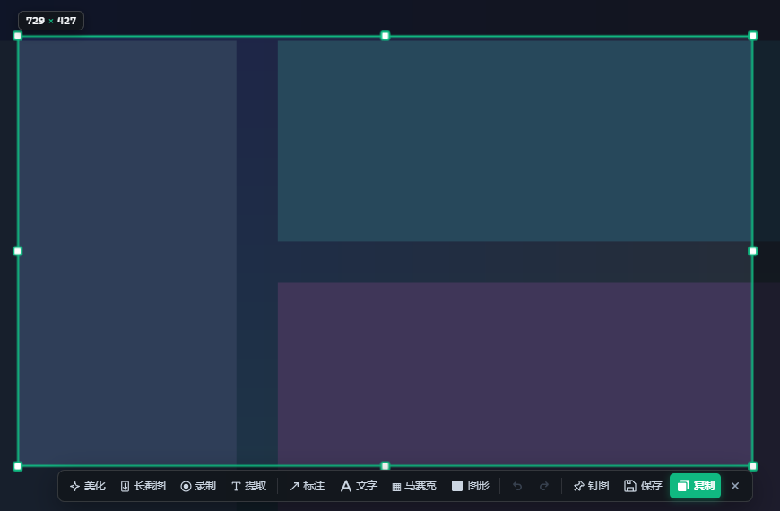
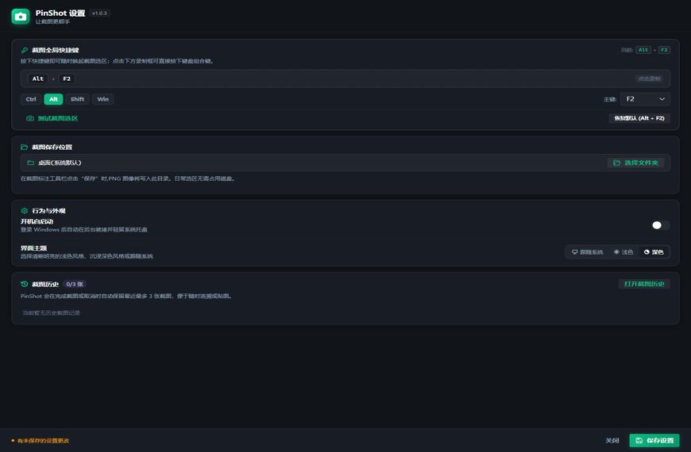

# PinShot

PinShot 是一款面向 Windows 的隐私优先截图工具。它支持快速截图、标注、置顶、OCR、滚动截图和录屏，并将截图历史保存在本地，方便随时回看。

## 界面预览




设置界面：




## 功能

- 全局快捷键唤起截图选区
- 截图标注、复制、保存和置顶显示
- 滚动截图与长图拼接
- 本地 OCR 文字识别
- 最近 3 张截图历史
- 录屏并导出 WebM / MP4
- 深色、浅色和跟随系统主题
- 可选开机自启动
- 截图与 OCR 默认在本机处理，不依赖云端服务

## 默认快捷键

默认截图快捷键为 `Alt + F2`。可以在设置界面中修改组合键。

## 开发

环境要求：

- Windows
- Node.js 22+
- pnpm
- Rust 1.77+

安装依赖并启动开发环境：

```powershell
pnpm install
pnpm tauri dev
```

运行前端测试：

```powershell
pnpm test
```

构建桌面应用：

```powershell
pnpm tauri build
```

## 技术栈

- Tauri 2
- Rust
- React 19
- TypeScript
- Vite
- PaddleOCR / ONNX Runtime

## 隐私

PinShot 的截图、截图历史和 OCR 处理设计为本地完成。应用不会因为截图功能自动上传屏幕内容；保存目录和历史数据由本机配置决定。

## 许可证

本项目原创代码采用 [Apache License 2.0](LICENSE) 发布。

三个 ONNX 模型为 RapidOCR 发布的 PaddleOCR 相关资产，本项目未再次转换；
第三方模型和软件依赖保留各自许可，详见 [第三方声明](THIRD_PARTY_NOTICES.md)
和 [完整许可清单](licenses/README.md)。

安装包会携带许可证及第三方声明。分发便携版时也请保留 `LICENSE`、
`THIRD_PARTY_NOTICES.md` 和 `licenses/`。更新依赖后运行
`pnpm licenses:generate` 并审核许可变化；`pnpm licenses:check` 用于检查清单是否过期。
